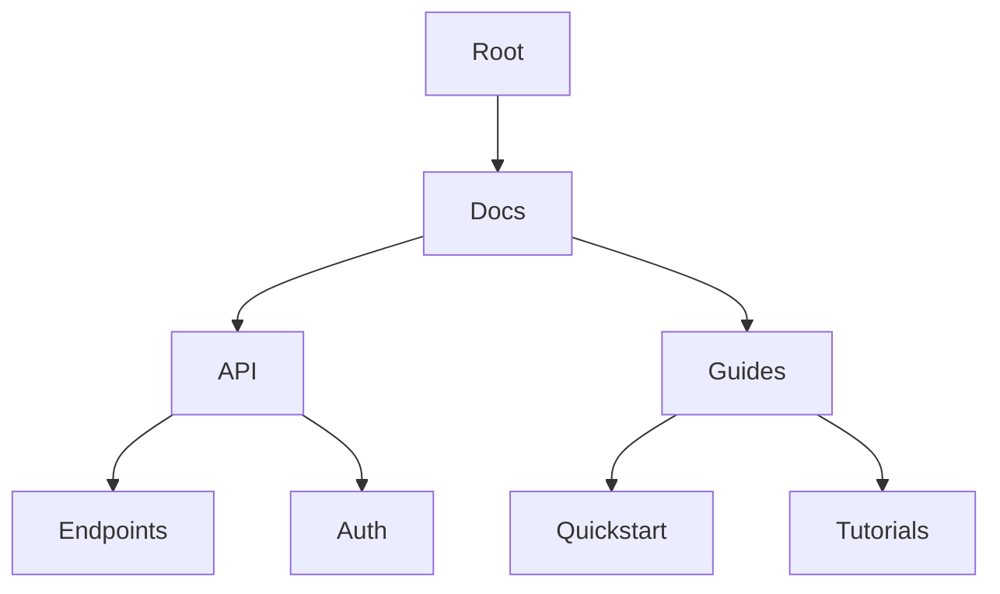

## Overview

Qubeq provides essential tools to manage your project documentation efficiently. You organize content into intuitive folder structures, track changes with version history, collaborate seamlessly with your team, and find information quickly using powerful search and tagging. These features help you maintain a centralized knowledge base that scales with your projects.

<Columns cols={2}>
  <Card title="Document Organization" icon="folder" href="#organization">
    Create nested folders and manage documents hierarchically.
  </Card>
  <Card title="Version Control" icon="git-branch" href="#version-control">
    Track changes and revert to previous versions easily.
  </Card>
  <Card title="Collaboration Tools" icon="users" href="#collaboration">
    Enable real-time editing and reviews for teams.
  </Card>
  <Card title="Search and Tagging" icon="search" href="#search-tagging">
    Locate content with advanced search and custom tags.
  </Card>
</Columns>

## Document Organization and Folder Structures

Organize your documentation using flexible folder structures. Create nested folders to mirror your project's architecture, making navigation intuitive. Qubeq supports unlimited nesting levels and drag-and-drop reorganization.



<Steps>
  <Step title="Create a Folder" icon="folder-plus">
    Navigate to your workspace and select `New Folder`. Enter a name like `API Reference`.
  </Step>
  <Step title="Nest Documents" icon="file-text">
    Drag documents into folders or use the `Move To` option.
  </Step>
  <Step title="Reorder" icon="move">
    Use drag-and-drop in the sidebar to adjust hierarchy.
  </Step>
</Steps>

<Callout kind="tip">
  Use descriptive folder names to improve discoverability for your team.
</Callout>

## Version Control and History Tracking

Qubeq's built-in version control lets you track every change. Each edit creates a new version with timestamps and authors. Revert changes or compare diffs without external tools.

<Tabs>
  <Tab title="View History" icon="clock">
    Right-click a document and select `Version History`. Browse commits chronologically.
  </Tab>
  <Tab title="Revert Changes" icon="undo">
    Select a previous version and click `Restore`. This creates a new version based on the selected one.
  </Tab>
</Tabs>

<CodeGroup tabs="JavaScript,Python">
  ```javascript
  // Fetch document versions via API
  const response = await fetch('https://api.qubeq.com/v1/docs/{docId}/versions', {
    headers: { Authorization: `Bearer YOUR_TOKEN` }
  });
  const versions = await response.json();
  console.log(versions);
  ```
  ```python
  import requests
  response = requests.get(
      'https://api.qubeq.com/v1/docs/{docId}/versions',
      headers={'Authorization': 'Bearer YOUR_TOKEN'}
  )
  versions = response.json()
  print(versions)
  ```
</CodeGroup>

## Collaboration Tools for Team Editing

Invite team members to collaborate in real-time. Assign roles like Editor or Viewer, and use comments for feedback. Changes sync instantly across users.

<Callout kind="info">
  Real-time cursors show who is editing where, reducing conflicts.
</Callout>

<Steps>
  <Step title="Invite Collaborators" icon="user-plus">
    Go to `Share` in document settings and add emails.
  </Step>
  <Step title="Set Permissions" icon="shield">
    Choose roles: Admin, Editor, or Viewer.
  </Step>
  <Step title="Review Comments" icon="message-circle">
    Resolve threaded comments directly in the editor.
  </Step>
</Steps>

## Search and Tagging Functionalities

Quickly find content with full-text search across all documents. Add custom tags for categorization, like `api`, `internal`, or `draft`.

| Feature       | Description                          |
|---------------|--------------------------------------|
| Full-Text Search | Searches titles, content, and tags. |
| Tag Management | Create, assign, and filter by tags. |
| Advanced Filters | Combine search with folders or dates.|

<Expandable title="Advanced Search Example" default-open="false">

Use the API for programmatic search:

<ParamField query="q" param-type="string" required="true">
  Search query string.
</ParamField>

<ParamField query="tags" param-type="array" required="false">
  Filter by tag names, e.g., `api,internal`.
</ParamField>

```javascript
const results = await fetch('https://api.qubeq.com/v1/search?q=authentication&tags=api');
```

</Expandable>

<Columns cols={3}>
  <Card title="Quickstart" icon="rocket" href="/quickstart">
    Get started in minutes.
  </Card>
  <Card title="Authentication" icon="key" href="/authentication">
    Secure your workspace.
  </Card>
  <Card title="API Reference" icon="code" href="/api">
    Integrate programmatically.
  </Card>
</Columns>